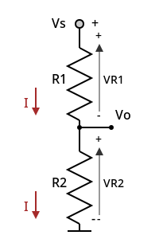
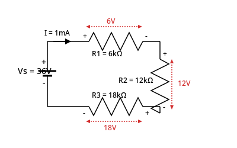
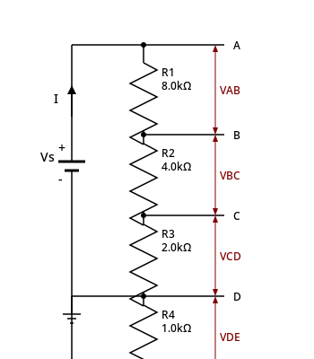
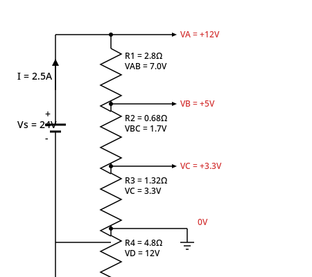

# TEMA 1: Recapitulare (Calcule matematice și conversii)

### Problema 1
Să se calculeze:
a. $10^3 \cdot 10 \cdot 10^{-12}$
b. $(10^3)^2 \cdot 10^{-9}$
c. $\frac{10^3 \cdot 10}{10^{-9} \cdot 10^4 \cdot 10^3}$
d. $\sqrt{10^{-3} \cdot 10^{-1} \cdot 10^9}$
e. $\sqrt{10^{-12} \cdot 10^2 \cdot 10^7}$

**Rezolvare:**
a. $10^3 \cdot 10^1 \cdot 10^{-12} = 10^{3+1-12} = 10^{-8}$
b. $(10^3)^2 \cdot 10^{-9} = 10^{3 \cdot 2} \cdot 10^{-9} = 10^{6-9} = 10^{-3}$
c. $\frac{10^3 \cdot 10^1}{10^{-9+4+3}} = \frac{10^4}{10^{-2}} = 10^{4 - (-2)} = 10^{4+2} = 10^6$
d. $\sqrt{10^{-3-1+9}} = \sqrt{10^5} = 10^{\frac{5}{2}} = 10^{2 + \frac{1}{2}} = 10^2 \cdot 10^{\frac{1}{2}} = 10^2 \cdot \sqrt{10}$ (sau $100\sqrt{10}$)
e. $\sqrt{10^{-12+2+7}} = \sqrt{10^{-3}} = 10^{-\frac{3}{2}} = \frac{1}{10^{\frac{3}{2}}} = \frac{1}{10^{1+\frac{1}{2}}} = \frac{1}{10^1 \cdot 10^{\frac{1}{2}}} = \frac{1}{10\sqrt{10}}$

---

### Problema 2
Să se exprime în kiloohmi valorile următoarelor rezistențe electrice *(Notă: la punctul b. s-a corectat valoarea din text pentru a corespunde cu rezolvarea din prezentare)*:
a. $R = 500[\Omega] + 0,01[M\Omega] + 2[k\Omega]$
b. $R = 500[\Omega] + 1,2[M\Omega] + 0,05[M\Omega] + 20[k\Omega] + 800[\Omega]$

**Rezolvare:**
a. $R = 500[\Omega] + 0,01[M\Omega] + 2[k\Omega] = 0,5[k\Omega] + 10[k\Omega] + 2[k\Omega] = 12,5[k\Omega]$
b. $R = 500[\Omega] + 1,2[M\Omega] + 0,05[M\Omega] + 20[k\Omega] + 800[\Omega] = 0,5[k\Omega] + 1200[k\Omega] + 50[k\Omega] + 20[k\Omega] + 0,8[k\Omega] = 1271,3[k\Omega]$

---

# TEMA 2: Legea lui Ohm (Regim de curent continuu și alternativ)

### Problema 3
Să se determine curentul electric printr-un rezistor a cărui rezistență electrică are valoarea $R = 10[k\Omega]$, dacă pe acesta se aplică:
a. O tensiune continuă de valoare $V_R = 5[V]$.
b. O tensiune sinusoidală de valoare $v_R(\omega \cdot t) = 2 + 1 \cdot \sin(\omega \cdot t)\ [V]$.
c. Să se calculeze valoarea curentului electric printr-o rezistență electrică de valoare infinită (elementul de circuit care are o rezistență electrică infinită se numește GOL).

**Rezolvare:**
**a.** Ecuația de funcționare a rezistorului este $V_R = R \cdot I_R$. Din această relație:
$I_R = \frac{V_R}{R} \Rightarrow I_R = \frac{5[V]}{10[k\Omega]} = 0,5\left[\frac{V}{k\Omega}\right] = 0,5[mA]$
*(Regulă de reținut: volt/kiloohm = miliamper ⇒ V/kΩ = mA)*.

**b.** Pentru tensiunea sinusoidală, ecuația este $v_R = R \cdot i_R$:
$i_R = \frac{v_R}{R} \Rightarrow i_R = \frac{2 + 1 \cdot \sin(\omega \cdot t)\ [V]}{10[k\Omega]} = \frac{2}{10} + \frac{1 \cdot \sin(\omega \cdot t)}{10}\ [mA]$
$i_R = 0,2 + 0,1 \cdot \sin(\omega \cdot t)\ [mA]$

Din această expresie reies parametrii curentului alternativ:
*   Valoare medie: $I_R = 0,2\ [mA]$
*   Amplitudine: $I_r = 0,1\ [mA]$
*   Faza inițială: $\varphi_I = 0\ [rad/s]$

**c.** Pentru $R \rightarrow \infty$, conform legii lui Ohm, intensitatea curentului tinde spre zero: $I = \frac{V}{\infty} = 0\ A$.

---

# TEMA 3: Probleme - Circuite Electrice (Legea lui Ohm și Legile lui Kirchhoff)

### PROBLEMA 01

**Schema circuitului:**

**Date:**
$R_1 = 10\ \Omega$, $R_2 = 20\ \Omega$, $R_3 = 20\ \Omega$, $R_4 = 20\ \Omega$, $V_1 = 12\ V$
**Se cer:** Rezistența echivalentă $R_E$, Intensitatea curentului $I$.

**Rezolvare:**
Calculez rezistența $R_{34} = R_3 \parallel R_4$, și rezistența echivalentă serie $R_E$:
$\frac{1}{R_{34}} = \frac{1}{R_3} + \frac{1}{R_4} \Rightarrow R_{34} = \frac{R_3 \cdot R_4}{R_3 + R_4}$
$R_{34} = \frac{20 \cdot 20}{20 + 20} = \frac{400}{40} = 10\ \Omega$

$R_E = R_1 + R_2 + R_{34} = 10 + 20 + 10 = 40\ \Omega$
$I = \frac{U}{R_E} = \frac{12\ V}{40\ \Omega} = 0,3\ A = 300\ mA$

**Soluția problemei:**
$R_E = 40\ \Omega$
$I = 0,3\ A$

---

### PROBLEMA 02

**Schema circuitului:**

**Date:**
$R_1 = 10\ \Omega$, $R_2 = 12\ \Omega$, $R_3 = 40\ \Omega$, $R_4 = 10\ \Omega$, $R_5 = 10\ \Omega$, $V_1 = 15\ V$
**Se cer:** Rezistența echivalentă $R_E$, Intensitatea curentului $I$.

**Rezolvare:**
Calculez $R_{15} = R_1 \parallel R_5$, $R_{34} = R_3 \parallel R_4$ și rezistența echivalentă serie $R_E$:
$R_{34} = \frac{R_3 \cdot R_4}{R_3 + R_4} = \frac{40 \cdot 10}{40 + 10} = \frac{400}{50} = 8\ \Omega$
$R_{15} = \frac{R_1 \cdot R_5}{R_1 + R_5} = \frac{10 \cdot 10}{10 + 10} = \frac{100}{20} = 5\ \Omega$

$R_E = R_{15} + R_2 + R_{34} = 5 + 12 + 8 = 25\ \Omega$
$I = \frac{U}{R_E} = \frac{15\ V}{25\ \Omega} = \frac{3}{5}\ A = 0,6\ A = 600\ mA$

**Soluția problemei:**
$R_E = 25\ \Omega$
$I = 0,6\ A$

---

### PROBLEMA 03

**Schema circuitului:**

**Date:**
$R_1 = 10\ \Omega$, $R_2 = 30\ \Omega$, $R_3 = 2,5\ \Omega$, $V_1 = 16\ V$
XMM1 = Ampermetru (I)
XMM2 = Ampermetru ($I_2$)
XMM3 = Ampermetru ($I_1$)
XMM4 = Voltmetru ($U_3 = U_{AB}$)
**Se cer:** $I_1, I_2, U_3, I, R_{12}, R_E$

**Rezolvare:**
Aplicând legile lui Kirchhoff, rezultă un sistem de 3 ecuații cu 3 necunoscute ($I, I_1, I_2$):
$$\begin{cases}
V_1 = I \cdot R_3 + I_2 \cdot R_2 \\
I_1 \cdot R_1 = I_2 \cdot R_2 \\
I = I_1 + I_2
\end{cases} \Rightarrow \begin{cases}
16 = 2,5 \cdot I + 30 \cdot I_2 \\
10 \cdot I_1 = 30 \cdot I_2 \Rightarrow I_1 = 3 \cdot I_2 \\
I = I_1 + I_2
\end{cases}$$

Înlocuind prima ecuație cu expresia curenților:
$16 = 2,5 \cdot (3 I_2 + I_2) + 30 I_2$
$16 = 2,5 \cdot 4 I_2 + 30 I_2$
$16 = 10 I_2 + 30 I_2$
$16 = 40 I_2 \Rightarrow I_2 = \frac{16}{40} = 0,4\ A$

Rezultă restul parametrilor:
$I_1 = 3 \cdot 0,4 = 1,2\ A$
$I = I_1 + I_2 = 1,2 + 0,4 = 1,6\ A$
$U_3 = R_3 \cdot I = 2,5 \cdot 1,6 = 4\ V$

$R_{12} = \frac{R_1 \cdot R_2}{R_1 + R_2} = \frac{10 \cdot 30}{10 + 30} = \frac{300}{40} = 7,5\ \Omega$
$R_E = R_3 + R_{12} = 2,5 + 7,5 = 10\ \Omega$

**Soluția problemei:**
$I_1 = 1,2\ A$, $I_2 = 0,4\ A$, $U_3 = 4\ V$, $I = 1,6\ A$, $R_{12} = 7,5\ \Omega$, $R_E = 10\ \Omega$

---

### PROBLEMA 04

**Schema circuitului:**

**Date:**
$R_1 = 12\ \Omega$, $R_2 = 36\ \Omega$, $V_1 = 18\ V$
XMM1 = Ampermetru ($I$)
XMM2 = Voltmetru ($U_1$)
XMM3 = Voltmetru ($U_2$)
**Se cer:** $U_1, U_2, I, R_E$

**Rezolvare:**
Conform legilor lui Kirchhoff:
$$\begin{cases}
V_1 = (R_1 + R_2) \cdot I \\
U_1 = R_1 \cdot I \\
U_2 = R_2 \cdot I
\end{cases}$$

$18 = (12 + 36) \cdot I$
$18 = 48 \cdot I \Rightarrow I = \frac{18}{48} = 0,375\ A$

$U_1 = R_1 \cdot I = 12 \cdot 0,375 = 4,5\ V$
$U_2 = R_2 \cdot I = 36 \cdot 0,375 = 13,5\ V$
$R_E = R_1 + R_2 = 12 + 36 = 48\ \Omega$

**Soluția problemei:**
$U_1 = 4,5\ V$, $U_2 = 13,5\ V$, $I = 0,375\ A$, $R_E = 48\ \Omega$

---

### PROBLEMA 05 (Circuit Mixt)

**Schema circuitului:**

**Date:**
$R_1 = 7\ \Omega$, $R_2 = 5\ \Omega$, $R_3 = 3\ \Omega$, $R_4 = 6\ \Omega$, $R_5 = 8\ \Omega$, $R_6 = 9\ \Omega$, $V_1 = 12\ V$
XMM1 = Ampermetru ($I$)
XMM2 = Voltmetru ($U_1$)
**Se cer:** $U_1, I, R_E$

**Rezolvare:**
Gruparea paralelă $R_2 \parallel R_3 \parallel R_4$:
$\frac{1}{R_{234}} = \frac{1}{R_2} + \frac{1}{R_3} + \frac{1}{R_4} = \frac{R_3 \cdot R_4 + R_2 \cdot R_4 + R_2 \cdot R_3}{R_2 \cdot R_3 \cdot R_4} = \frac{3 \cdot 6 + 5 \cdot 6 + 5 \cdot 3}{5 \cdot 3 \cdot 6}$
$\frac{1}{R_{234}} = \frac{18 + 30 + 15}{90} = \frac{63}{90} = \frac{7}{10} \Rightarrow R_{234} = \frac{10}{7} \approx 1,428\ \Omega$

Rezistența echivalentă totală se obține adunând rezistențele aflate în serie:
$R_E = R_1 + R_{234} + R_5 + R_6 = 7 + 1,428 + 8 + 9 = 25,428\ \Omega$

Intensitatea curentului principal $I$:
$I = \frac{U}{R_E} = \frac{12}{25,428} \approx 0,472\ A$

Tensiunea pe rezistorul $R_1$:
$U_1 = R_1 \cdot I = 7 \cdot 0,472 = 3,3\ V$

**Observație:** Rezistența echivalentă a grupării paralel ($R_{234} = 1,428\ \Omega$) este mai mică decât oricare dintre rezistențele componente ($R_2, R_3, R_4$).

---

# TEMA 4: Divizoare de tensiune

## Problema 1: Divizor simplu cu două rezistoare

**Condiția și cerința problemei:**
Cât de mult curent va circula printr-un rezistor de $20\ \Omega$ conectat în serie cu un rezistor de $40\ \Omega$ când tensiunea de alimentare pe combinația serie este de $12\text{ volți c.c.}$ De asemenea, calculați căderea de tensiune produsă pe fiecare rezistor.

**Schema circuitului:**

**Rezolvare:**
$$R_T = R_1 + R_2 = 20 + 40 = 60\Omega$$

$$I = \frac{V_S}{R_T} = \frac{12}{60} = 0.2 \text{ [Amps, A] or } 200\text{mA}$$

$$V_{R1} = I \times R_1 = V_S \left( \frac{R_1}{R_1 + R_2} \right) = 12 \left( \frac{20}{20 + 40} \right) = 4\text{ volts}$$

$$V_{R2} = I \times R_2 = V_S \left( \frac{R_2}{R_1 + R_2} \right) = 12 \left( \frac{40}{20 + 40} \right) = 8\text{ volts}$$

***

## Problema 2: Divizor cu trei rezistoare în buclă

**Condiția și cerința problemei:**
Trei elemente rezistive de $6\text{k}\Omega$, $12\text{k}\Omega$ și $18\text{k}\Omega$ sunt conectate împreună în serie cu o sursă de $36\text{ volți}$. Calculați rezistența totală, valoarea curentului care circulă în circuit și tensiunea ce cade pe fiecare rezistor. 
Date: $VS = 36\text{ volți}$, $R1 = 6\text{k}\Omega$, $R2 = 12\text{k}\Omega$ și $R3 = 18\text{k}\Omega$.

**Schema circuitului:**

**Rezolvare:**
$$R_T = R_1 + R_2 + R_3 = 6k\Omega + 12k\Omega + 18k\Omega = 36k\Omega$$

$$I = \frac{V_S}{R_T} = \frac{36}{36000} = 1\text{mA}$$

$$V_{R1} = V_S \left( \frac{R_1}{R_T} \right) = 36 \left( \frac{6000}{36000} \right) = 6\text{ volts}$$

$$V_{R2} = V_S \left( \frac{R_2}{R_T} \right) = 36 \left( \frac{12000}{36000} \right) = 12\text{ volts}$$

$$V_{R3} = V_S \left( \frac{R_3}{R_T} \right) = 36 \left( \frac{18000}{36000} \right) = 18\text{ volts}$$

***

## Problema 3: Rețea divizoare cu multiple puncte de priză (fără sarcină)

**Condiția și cerința problemei:**
Considerați o lungă serie de rezistoare conectate la o sursă de tensiune $Vs$. De-a lungul rețelei serie există diferite puncte de priză de tensiuni diferite, A, B, C, D și E. Rezistența totală a seriei poate fi găsită prin simpla adunare a valorilor rezistențelor individuale serie, oferind o rezistență totală în valoare $R_T$ de $15\text{k}\Omega$.
1. Se calculează ieșirea de tensiune fără sarcină între punctele B și E.
2. Calculați ieșirea de tensiune fără sarcină pentru fiecare punct de priză al circuitului divizor de tensiune de mai sus dacă rețeaua rezistivă conectată în serie este conectată la o sursă de curent continuu de $15\text{ volți}$.

**Schema circuitului:**

**Rezolvare:**
Rezistența totală:
$$R_T = R_1 + R_2 + R_3 + R_4 = 8k\Omega + 4k\Omega + 2k\Omega + 1k\Omega = 15k\Omega$$

Pentru ieșirea de tensiune între punctele B și E:
$$V_{BE} = V_S \left( \frac{R_2 + R_3 + R_4}{R_T} \right) = 15 \left( \frac{4k\Omega + 2k\Omega + 1k\Omega}{15k\Omega} \right) = 7\text{ volts}$$

Pentru ieșirile de tensiune în fiecare punct de priză:
$$V_{R1} = V_{AB} = V_S \left( \frac{R_1}{R_T} \right) = 15 \left( \frac{8000}{15000} \right) = 8\text{ volts}$$

$$V_{R2} = V_{BC} = V_S \left( \frac{R_2}{R_T} \right) = 15 \left( \frac{4000}{15000} \right) = 4\text{ volts}$$

$$V_{R3} = V_{CD} = V_S \left( \frac{R_3}{R_T} \right) = 15 \left( \frac{2000}{15000} \right) = 2\text{ volts}$$

$$V_{R4} = V_{DE} = V_S \left( \frac{R_4}{R_T} \right) = 15 \left( \frac{1000}{15000} \right) = 1\text{ volts}$$

***

## Problema 4: Divizor de tensiune cu punct de masă (referință) decalat

**Condiția și cerința problemei:**
Folosind Legea lui Ohm, găsiți valorile rezistențelor R1, R2, R3 și R4 necesare pentru a produce nivele de tensiune de $-12\text{V}, +3,3\text{V}, +5\text{V} \text{ și } +12\text{V}$ dacă puterea totală furnizată circuitului divizor de tensiune fără sarcină este de $24\text{ volți DC, } 60\text{ wați}$. 
În acest exemplu, punctul de referință la masă cu tensiune-zero a fost mutat pentru a produce tensiunile pozitive și negative necesare. Astfel, cele patru tensiuni sunt toate măsurate în raport cu acest punct de referință comun.

**Schema circuitului:**

**Rezolvare:**
Puterea și curentul total:
$$P = V \times I \quad \Rightarrow \quad I = \frac{P}{V} = \frac{60}{24} = 2.5\text{A}$$

Calculul fiecărei rezistențe folosind Legea lui Ohm ($R = \frac{U}{I}$):
$$R_1 = \frac{V_A - V_B}{I} = \frac{12 - 5}{2.5} = 2.8\Omega$$

$$R_2 = \frac{V_B - V_C}{I} = \frac{5 - 3.3}{2.5} = 0.68\Omega$$

$$R_3 = \frac{V_C - 0}{I} = \frac{3.3}{2.5} = 1.32\Omega$$

$$R_4 = \frac{V_D - 0}{I} = \frac{12}{2.5} = 4.8\Omega$$

---
# TEMA 5: Diode Semiconductoare

## Problema 1

**Condiția problemei:**
O diodă semiconductoare are caracteristica de funcționare indicată în figura de mai jos. Să se determine valoarea rezistenței de curent continuu a diodei respective dacă:
a. curentul continuu prin aceasta este egal cu $20 \text{ [mA]}$.
b. curentul continuu prin aceasta este egal cu $2 \text{ [mA]}$.
c. tensiunea continuă pe aceasta este egală cu $-10 \text{ [V]}$.

**Schema:**

**Rezolvare:**
a. Conform caracteristicii de funcționare, atunci când curentul continuu prin dioda considerată este egal cu $20 \text{ [mA]}$, tensiunea pe aceasta este egală cu $0,8 \text{ [V]}$. În acest caz, valoarea rezistenței diodei în curent continuu este:
$$R_D = \frac{V_D}{I_D} = \frac{0,8 \text{ [V]}}{20 \text{ [mA]}} = \frac{0,8}{20} \text{ [k}\Omega] = 0,04 \text{ [k}\Omega] = 40 [\Omega]$$

b. Conform caracteristicii de funcționare, atunci când curentul continuu prin dioda considerată este egal cu $2 \text{ [mA]}$, tensiunea pe aceasta este egală cu $0,5 \text{ [V]}$. În acest caz, valoarea rezistenței diodei în curent continuu este:
$$R_D = \frac{V_D}{I_D} = \frac{0,5 \text{ [V]}}{2 \text{ [mA]}} = \frac{0,5}{2} \text{ [k}\Omega] = 0,25 \text{ [k}\Omega] = 250 [\Omega]$$

c. Conform caracteristicii de funcționare, atunci când tensiunea continuă pe dioda considerată este egală cu $-10 \text{ [V]}$, curentul electric prin aceasta este egală cu $-1 \text{ [}\mu\text{A]}$. În acest caz, valoarea rezistenței diodei în curent continuu este:
$$R_D = \frac{V_D}{I_D} = \frac{-10 \text{ [V]}}{-1 \text{ [}\mu\text{A]}} = \frac{10}{1} \text{ [M}\Omega] = 10 \text{ [M}\Omega]$$
$\text{M}\Omega = \text{megohmi} = 10^6 \text{ ohmi}$

---

## Problema 2

**Condiția problemei:**
O diodă semiconductoare are caracteristica de funcționare indicată în figura de mai jos. Să se determine valoarea rezistenței diodei respective dacă curentul electric variază prin diodă între valoarea minimă $2 \text{ [mA]}$ și valoarea maximă $17 \text{ [mA]}$.

**Schema:**

**Rezolvare:**
Conform caracteristicii de funcționare, atunci când valoarea curentului electric prin diodă atinge valoarea minimă de $2 \text{ [mA]}$, valoarea tensiunii pe diodă are valoarea $0,65 \text{ [V]}$, iar când valoarea curentului electric prin diodă atinge valoarea maximă de $17 \text{ [mA]}$, valoarea tensiunii pe diodă are valoarea $0,725 \text{ [V]}$. În acest caz, variația curentului electric prin diodă este
$$\Delta i_D = i_{D\text{ max}} - i_{D\text{ min}} = 17 \text{ [mA]} - 2 \text{ [mA]} = 15 \text{ [mA]}$$
iar variația tensiunii electrice pe diodă este.
$$\Delta v_D = v_{D\text{ max}} - v_{D\text{ min}} = 0,725 \text{ [V]} - 0,65 \text{ [V]} = 0,075 \text{ [V]} = 75 \text{ [mV]}$$

Regimul în care dioda funcționează se decide în funcție de amplitudinea tensiunii pe diodă, notată $V_d$, care este egală cu jumătatea variației tensiunii pe diodă:
$$V_d = \frac{\Delta v_D}{2} = \frac{75}{2} \text{ [mV]} = 37,5 \text{ [mV]}$$

Deoarece amplitudinea tensiunii pe diodă este de ordinul zecilor de milivolți, se poate considera că dioda funcționează în regim variabil de semnal mare, și în acest caz, valoarea rezistenței de semnal mare a diodei este:
$$r_D = \frac{\Delta v_D}{\Delta i_D} = \frac{0,075 \text{ [V]}}{15 \text{ [mA]}} = 0,005 \text{ [k}\Omega] = 5 [\Omega]$$

---

## Problema 3

**Condiția problemei:**
O diodă semiconductoare are caracteristica de funcționare indicată în figura de mai jos. Să se determine valoarea rezistenței diodei respective dacă curentul electric variază prin diodă între valoarea minimă $20 \text{ [mA]}$ și valoarea maximă $30 \text{ [mA]}$, iar valoarea curentului continuu a acestuia este egală cu $25 \text{ [mA]}$. Rezistența diodei se calculează la temperatura $T=25^0\text{C}$.

**Schema:**

**Rezolvare:**
Conform caracteristicii de funcționare, atunci când valoarea curentului electric prin diodă atinge valoarea minimă de $20 \text{ [mA]}$, valoarea tensiunii pe diodă are valoarea $0,78 \text{ [V]}$, iar când valoarea curentului electric prin diodă atinge valoarea maximă de $30 \text{ [mA]}$, valoarea tensiunii pe diodă are valoarea $0,8 \text{ [V]}$. În acest caz, variația tensiunii electrice pe diodă este.
$$\Delta v_D = v_{D\text{ max}} - v_{D\text{ min}} = 0,8 \text{ [V]} - 0,78 \text{ [V]} = 0,002 \text{ [V]} = 20 \text{ [mV]}$$

Regimul în care dioda funcționează se decide în funcție de amplitudinea tensiunii pe diodă, notată $V_d$, care este egală cu jumătatea variației tensiunii pe diodă:
$$V_d = \frac{\Delta v_D}{2} = \frac{20}{2} \text{ [mV]} = 10 \text{ [mV]}$$

Deoarece amplitudinea tensiunii pe diodă este mai mică decât $12,5$ milivolți, se poate considera că dioda funcționează în regim variabil de semnal mic, și în acest caz, valoarea rezistenței de semnal mare a diodei este:
$$r_d = \frac{V_T}{I_D} = \frac{25 \text{ [mV]}}{25 \text{ [mA]}} = 1 [\Omega]$$

---

## Problema 4

**Condiția problemei:**
Pentru figura de mai jos se consideră $\text{E}=5 \text{ [V]}$, $\text{R}=220 \text{ [}\Omega\text{]}$. 
a. Care este regiunea în care funcționează dioda? 
b. Să se determine valoarea curentului continuu prin diodă. 
c. Să se calculeze valoarea rezistenței de curent continuu a diodei. 
d. Să se calculeze valoarea rezistenței de semnal mic a diodei la temperatura $\text{T}=25^0\text{C}$.

**Schema:**

**Rezolvare:**
a. Deoarece singura sursă de alimentare din circuit este o sursă de tensiune continuă, dioda funcționează în regim de curent continuu. În continuare, se observă că borna negativă a sursei de alimentare E se aplică direct pe catodul diodei, iar borna pozitivă a sursei de alimentare E se aplică pe anodul diodei prin intermediul rezistorului R. În aceste condiții, potențialul electric aplicat pe anod are o valoare mai mare decât cel aplicat pe catod și în consecință dioda funcționează în regiunea de conducție directă.

b. Pentru calculul curentului continuu prin circuit, dioda se înlocuiește cu circuitul său echivalent în curent continuu, în conducție directă, iar circuitul inițial devine cel din figura de mai jos. **Atenție!** **Sensul curentului electric prin diodă trebuie orientat de la anod spre catod, iar sursa de tensiune $V_D$ care modelează dioda trebuie să fie orientată cu borna pozitivă la anod, iar cea negativă la catod.** Dacă nu se respectă aceste convenții, circuitul echivalent pe care se fac calculele în regim de curent continuu este greșit.

Circuitul echivalent de calcul a curentului continuu.

Relația matematică a curentului continuu se deduce aplicând teorema lui Kirkhoff 2 pe bucla de circuit formată; alegând pentru sensul de parcurgere al buclei sensul orar, rezultă:
$$R \cdot I_D + V_D - E = 0 \Rightarrow I_D = \frac{E - V_D}{R}$$

Deoarece pentru parametrul $V_D$ nu s-a specificat explicit nicio valoare, se consideră $V_D = 0,6 \text{ [V]}$

$$\Rightarrow I_D = \frac{5 \text{ [V]} - 0,6 \text{ [V]}}{220 \text{ [}\Omega\text{]}} = \frac{4,4 \text{ [V]}}{0,220 \text{ [k}\Omega\text{]}} = 20 \text{ [mA]}$$

c. Rezistența de curent continuu a diodei se calculează cu relația:
$$R_D = \frac{V_D}{I_D} = \frac{0,6 \text{ [V]}}{20 \text{ [mA]}} = \frac{0,6}{20} \text{ [k}\Omega] = 0,03 \text{ [k}\Omega] = 30 [\Omega]$$

d. Rezistența de semnal mic a diodei se calculează cu relația:
$$r_d = \frac{V_T}{I_D} = \frac{25 \text{ [mV]}}{20 \text{ [mA]}} = 1,25 [\Omega]$$

---

## Problema 5

**Condiția problemei:**
Pentru figura de mai jos se consideră $\text{E1}=10 \text{ [V]}$, $\text{R1}=4,7 \text{ [k}\Omega\text{]}$, $\text{E2}=5 \text{ [V]}$, $\text{R2}=2,2 \text{ [k}\Omega\text{]}$. Să se calculeze valoarea curentului continuu prin diodă și valoarea tensiunii $\text{V}$.

**Schema:**

**Rezolvare:**
Deoarece singurele surse de alimentare din circuit sunt surse de tensiune continuă, dioda funcționează în regim de curent continuu. În continuare, se presupune că dioda funcționează în regiunea de conducție directă și se calculează curentul continuu prin diodă, stabilit cu sensul de la anod spre catod. În cazul în care valoarea numerică a curentului calculat rezultă pozitivă, atunci presupunerea este adevărată, iar dioda funcționează în conducție directă. În cazul în care valoarea numerică a curentului calculat rezultă negativă, atunci presupunerea este falsă, iar dioda funcționează în conducție inversă. Pentru calculul curentului continuu prin circuit, dioda se înlocuiește cu circuitul său echivalent în curent continuu, în conducție directă, iar circuitul inițial devine cel din figura de mai jos.

Circuitul echivalent de calcul a curentului continuu.

Relația matematică a curentului continuu se deduce aplicând teorema lui Kirkhoff 2 pe bucla de circuit formată; alegând pentru sensul de parcurgere al buclei sensul orar, rezultă:
$$R_1 \cdot I_D + V_D + R_2 \cdot I_D - E_2 - E_1 = 0 \Rightarrow I_D = \frac{E_1 + E_2 - V_D}{R_1 + R_2}$$

Deoarece pentru parametrul $V_D$ nu s-a specificat explicit nicio valoare, se consideră $V_D = 0,6 \text{ [V]}$
$$\Rightarrow I_D = \frac{10 \text{ [V]} + 5 \text{ [V]} - 0,6 \text{ [V]}}{4,7 \text{ [k}\Omega\text{]} + 2,2 \text{ [k}\Omega\text{]}} = \frac{14,4 \text{ [V]}}{6,9 \text{ [k}\Omega\text{]}} \cong 2,08 \text{ [mA]}$$

Valoarea curentului electric, cu sensul de la anod spre catod a rezultat pozitivă, deci presupunerea este corectă. În cazul în care valoarea curentului electric ar fi rezultat negativă, atunci dioda ar fi funcționat în conducție inversă. În acest caz, curentul continuu prin diodă ar fi fost considerat zero, deoarece atunci când funcționează în conducție inversă, dioda nu permite trecerea curentului electric prin ea.
Tensiunea $\text{V}$ este tensiunea care cade pe elementele de circuit $\text{R2}$ și $\text{E2}$. Ținând cont de referințele mărimilor electrice din circuit, tensiunea $\text{V}$ se calculează cu relația:
$$V = R_2 \cdot I_D - E_2 = 2,2 \text{ [k}\Omega\text{]} \cdot 2,08 \text{ [mA]} - 5 \text{ [V]} = 4,57 \text{ [V]} - 5 \text{ [V]} = -0,43 \text{ [V]}$$

---

## Problema 6

**Condiția problemei:**
Pentru figura de mai jos se consideră $\text{E1}=15 \text{ [V]}$, $\text{R}=2,2 \text{ [k}\Omega\text{]}$, $\text{E2}=4 \text{ [V]}$. Să se calculeze valoarea curentului continuu prin cele două diode.

**Schema:**

**Rezolvare:**
Deoarece singurele surse de alimentare din circuit sunt surse de tensiune continuă, diodele funcționează în regim de curent continuu. În continuare, se observă că borna minus a sursei $\text{E2}$ este aplicată direct pe catodul lui $\text{D1}$, respectiv pe anodul lui $\text{D2}$. Din aceste motive, $\text{D1}$ funcționează în conducție directă, iar $\text{D2}$ în conducție inversă. $\text{D2}$ funcționând în conducție inversă, curentul electric prin ea este nul $\text{I}_{\text{D2}} = 0 \text{ [A]}$. Curentul prin $\text{D1}$ se calculează pe circuitul echivalent de mai jos, în care cele 2 diode sunt înlocuite cu circuitele lor echivalente în curent continuu, în funcție de regiunea de funcționare.

Circuitul echivalent de calcul a curentului continuu.

Relația matematică a curentului continuu prin $\text{D1}$ se deduce aplicând teorema lui Kirkhoff 2 pe bucla de circuit formată; alegând pentru sensul de parcurgere al buclei sensul orar, rezultă:
$$R \cdot I_{D1} + V_D - E_2 - E_1 = 0 \Rightarrow I_{D1} = \frac{E_1 + E_2 - V_D}{R}$$

Deoarece pentru parametrul $V_D$ nu s-a specificat explicit nicio valoare, se consideră $V_D = 0,6 \text{ [V]}$
$$\Rightarrow I_{D1} = \frac{15 \text{ [V]} + 4 \text{ [V]} - 0,6 \text{ [V]}}{2,2 \text{ [k}\Omega\text{]}} = \frac{18,4 \text{ [V]}}{2,2 \text{ [k}\Omega\text{]}} \cong 8,36 \text{ [mA]}$$

---

## Problema 7

**Condiția problemei:**
Pentru figura de mai jos se consideră $\text{E}=20 \text{ [V]}$, $\text{R1}=4,7 \text{ [k}\Omega\text{]}$, $\text{R2}=3,5 \text{ [k}\Omega\text{]}$, iar parametrii diodelor sunt $\text{V}_{\text{D1}}=0,65 \text{ [V]}$, respectiv $\text{V}_{\text{D2}}=0,7 \text{ [V]}$. Să se calculeze valoarea curentului continuu prin cele 2 diode.

**Schema:**

**Rezolvare:**
Deoarece singura sursă de alimentare din circuit este sursă de tensiune continuă, diodele funcționează în regim de curent continuu. În continuare, se presupune că ambele diode funcționează în regiunea de conducție directă și se calculează curenții continui prin acestea, al căror sens este stabilit de la anod spre catod. În cazul în care valoarea numerică a curenților calculați rezultă pozitivi, atunci presupunerea este adevărată, iar diodele funcționează în conducție directă. În cazul în care valoarea numerică a unui curent calculat rezultă negativă, atunci presupunerea este falsă, iar dioda respectivă funcționează în conducție inversă, caz în care curentul prin aceasta este nul.

Circuitul echivalent de calcul a curentului continuu.

Aplicând teorema lui Kirkhoff 2 pe bucla de circuit formată din elementele $\text{R2}$ și $\text{VD2}$, alegând pentru sensul de parcurgere al buclei respective sensul orar, rezultă:
$$R_2 \cdot I - V_{D2} = 0 \Rightarrow I = \frac{V_{D2}}{R_2} \Rightarrow I = \frac{0,7 \text{ [V]}}{3,5 \text{ [k}\Omega\text{]}} = 0,2 \text{ [mA]}$$

Aplicând teorema lui Kirkhoff 2 pe bucla de circuit formată din elementele $\text{VD1}$, $\text{VD2}$, $\text{R1}$ și $\text{E}$, alegând pentru sensul de parcurgere al buclei respective sensul orar, rezultă:
$$V_{D1} + V_{D2} + R_1 \cdot I_{D1} - E = 0 \Rightarrow I_{D1} = \frac{E - (V_{D1} + V_{D2})}{R_1} \Rightarrow I_{D1} = \frac{20 \text{ [V]} - (0,65 \text{ [V]} + 0,7 \text{ [V]})}{4,7 \text{ [k}\Omega\text{]}} = \frac{18,65 \text{ [V]}}{4,7 \text{ [k}\Omega\text{]}} = \frac{18,65}{4,7} \text{ [mA]} \cong 3,96 \text{ [mA]}$$

Atenție! Curentul prin $\text{R1}$ nu este $\text{I}$, ci $\text{I}_{\text{D1}}$. Curentul $\text{I}$ circulă numai prin ramura compusă dintr-un singur element și anume $\text{R2}$. Datorită nodurilor de circuit superior, respectiv inferior, pe ramura $\text{R1}$, $\text{E}$, $\text{VD1}$ curentul este $\text{I}_{\text{D1}}$, diferit de $\text{I}$.

Aplicând teorema lui Kirkhoff 1 în nodul superior, rezultă:
$$I_{D1} = I_{D2} + I \Rightarrow I_{D2} = I_{D1} - I \Rightarrow I_{D2} = 3,96 \text{ [mA]} - 0,2 \text{ [mA]} = 3,76 \text{ [mA]}$$
