# Probleme și rezolvări extrase din surse

Acest document păstrează doar exercițiile și pașii de rezolvare necesari. Am rescris textul și calculele în Markdown, iar imaginile au rămas doar pentru schemele de circuit care sunt necesare pentru înțelegerea problemei.

## 1. Divizoare de tensiune

### Problema 1

Un rezistor de $20\,\Omega$ este conectat în serie cu un rezistor de $40\,\Omega$, iar tensiunea de alimentare este $12\,V$. Să se determine curentul din circuit și căderile de tensiune pe fiecare rezistor.

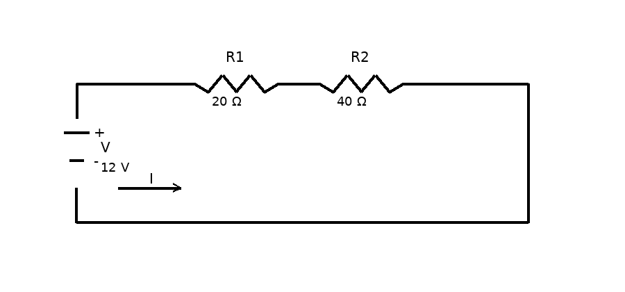

**Rezolvare**

Rezistența totală:

$$
R_T = R_1 + R_2 = 20 + 40 = 60\,\Omega
$$

Curentul din circuit:

$$
I = \frac{V}{R_T} = \frac{12}{60} = 0{,}2\,A = 200\,mA
$$

Tensiunea pe rezistorul de $20\,\Omega$:

$$
V_{R_1} = I \cdot R_1 = 0{,}2 \cdot 20 = 4\,V
$$

Tensiunea pe rezistorul de $40\,\Omega$:

$$
V_{R_2} = I \cdot R_2 = 0{,}2 \cdot 40 = 8\,V
$$

**Răspuns:** $I = 0{,}2\,A$, $V_{R_1} = 4\,V$, $V_{R_2} = 8\,V$.

---

### Problema 2

Trei rezistoare de $6\,k\Omega$, $12\,k\Omega$ și $18\,k\Omega$ sunt conectate în serie la o sursă de $36\,V$. Să se determine rezistența totală, curentul și tensiunea pe fiecare rezistor.

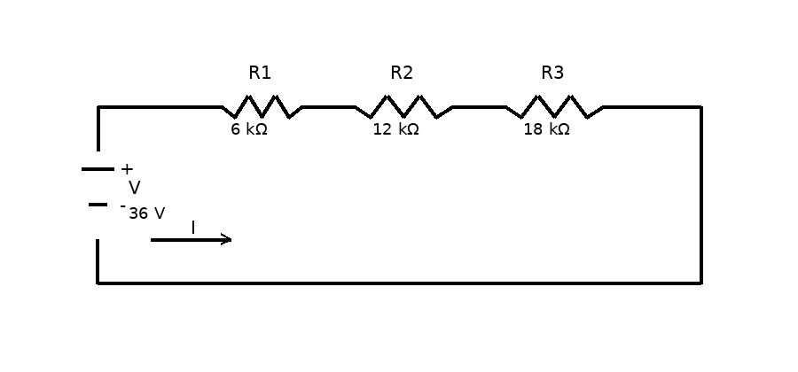

**Rezolvare**

Rezistența totală:

$$
R_T = 6\,k\Omega + 12\,k\Omega + 18\,k\Omega = 36\,k\Omega
$$

Curentul:

$$
I = \frac{V}{R_T} = \frac{36\,V}{36\,k\Omega} = 1\,mA
$$

Tensiunea pe fiecare rezistor:

$$
V_{R_1} = I \cdot R_1 = 1\,mA \cdot 6\,k\Omega = 6\,V
$$

$$
V_{R_2} = I \cdot R_2 = 1\,mA \cdot 12\,k\Omega = 12\,V
$$

$$
V_{R_3} = I \cdot R_3 = 1\,mA \cdot 18\,k\Omega = 18\,V
$$

**Răspuns:** $R_T = 36\,k\Omega$, $I = 1\,mA$, $V_{R_1} = 6\,V$, $V_{R_2} = 12\,V$, $V_{R_3} = 18\,V$.

---

### Problema 3

Pentru rețeaua cu prize de tensiune din sursă, alimentată la $15\,V$, să se calculeze ieșirea de tensiune fără sarcină pentru fiecare punct de priză.

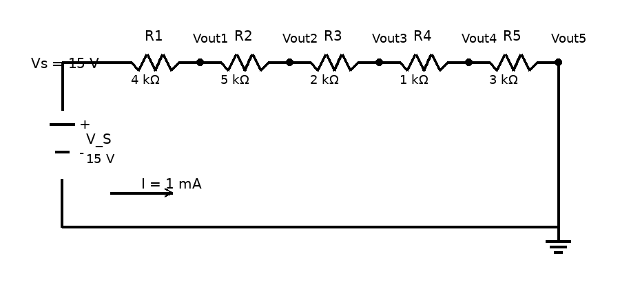

**Date din sursă**

$$
R_1 = 4\,k\Omega,\quad
R_2 = 5\,k\Omega,\quad
R_3 = 2\,k\Omega,\quad
R_4 = 1\,k\Omega,\quad
R_5 = 3\,k\Omega
$$

$$
V_S = 15\,V
$$

**Rezolvare**

Rezistența totală:

$$
R_T = R_1 + R_2 + R_3 + R_4 + R_5 = 15\,k\Omega
$$

Curentul prin lanțul serie:

$$
I = \frac{V_S}{R_T} = \frac{15\,V}{15\,k\Omega} = 1\,mA
$$

Tensiunile de ieșire față de masă, conform rezolvării din sursă:

$$
V_{out1} = V_S - I R_1 = 15 - 1\,mA \cdot 4\,k\Omega = 11\,V
$$

$$
V_{out2} = V_{out1} - I R_2 = 11 - 1\,mA \cdot 5\,k\Omega = 6\,V
$$

$$
V_{out3} = V_{out2} - I R_3 = 6 - 1\,mA \cdot 2\,k\Omega = 4\,V
$$

$$
V_{out4} = V_{out3} - I R_4 = 4 - 1\,mA \cdot 1\,k\Omega = 3\,V
$$

$$
V_{out5} = V_{out4} - I R_5 = 3 - 1\,mA \cdot 3\,k\Omega = 0\,V
$$

**Răspuns:** $11\,V$, $6\,V$, $4\,V$, $3\,V$, $0\,V$.

---

### Problema 4

Să se determine valorile rezistențelor $R_1$, $R_2$, $R_3$, $R_4$ astfel încât să se obțină nivelele de tensiune $-12\,V$, $+3{,}3\,V$, $+5\,V$ și $+12\,V$, iar puterea totală disipată în divizorul fără sarcină să fie $24\,W$.

**Rezolvare**

Din sursă rezultă tensiunea totală:

$$
V_T = 24\,V
$$

și puterea totală:

$$
P = 24\,W
$$

Curentul prin divizor:

$$
P = V_T \cdot I \Rightarrow I = \frac{P}{V_T} = \frac{24}{24} = 1\,A
$$

Căderile de tensiune pe rezistoare, conform nivelelor cerute:

$$
U_{R_1} = 12 - 5 = 7\,V
$$

$$
U_{R_2} = 5 - 3{,}3 = 1{,}7\,V
$$

$$
U_{R_3} = 3{,}3 - 0 = 3{,}3\,V
$$

$$
U_{R_4} = 0 - (-12) = 12\,V
$$

Cu $R = \frac{U}{I}$ și $I = 1\,A$:

$$
R_1 = \frac{7}{1} = 7\,\Omega
$$

$$
R_2 = \frac{1{,}7}{1} = 1{,}7\,\Omega
$$

$$
R_3 = \frac{3{,}3}{1} = 3{,}3\,\Omega
$$

$$
R_4 = \frac{12}{1} = 12\,\Omega
$$

**Răspuns:** $R_1 = 7\,\Omega$, $R_2 = 1{,}7\,\Omega$, $R_3 = 3{,}3\,\Omega$, $R_4 = 12\,\Omega$.

---

## 2. Legea lui Ohm și legile lui Kirchhoff

### Problema 1

Date:

$$
R_1 = 10\,\Omega,\quad
R_2 = 20\,\Omega,\quad
R_3 = 20\,\Omega,\quad
R_4 = 20\,\Omega,\quad
V_1 = 12\,V
$$

Să se determine rezistența echivalentă și intensitatea curentului.

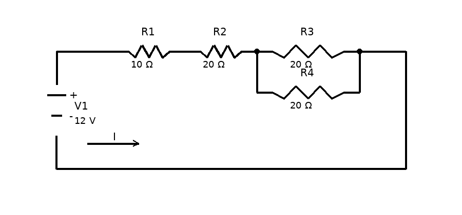

**Rezolvare**

Rezistența paralelă:

$$
\frac{1}{R_{34}} = \frac{1}{R_3} + \frac{1}{R_4}
$$

$$
R_{34} = \frac{R_3 R_4}{R_3 + R_4}
= \frac{20 \cdot 20}{20 + 20}
= 10\,\Omega
$$

Rezistența echivalentă totală:

$$
R_E = R_1 + R_2 + R_{34}
= 10 + 20 + 10
= 40\,\Omega
$$

Curentul:

$$
I = \frac{U}{R_E}
= \frac{12}{40}
= 0{,}3\,A
$$

**Răspuns:** $R_E = 40\,\Omega$, $I = 0{,}3\,A$.

---

### Problema 2

Date:

$$
R_1 = 10\,\Omega,\quad
R_2 = 12\,\Omega,\quad
R_3 = 40\,\Omega,\quad
R_4 = 10\,\Omega,\quad
R_5 = 10\,\Omega,\quad
V_1 = 15\,V
$$

Să se determine rezistența echivalentă și intensitatea curentului.

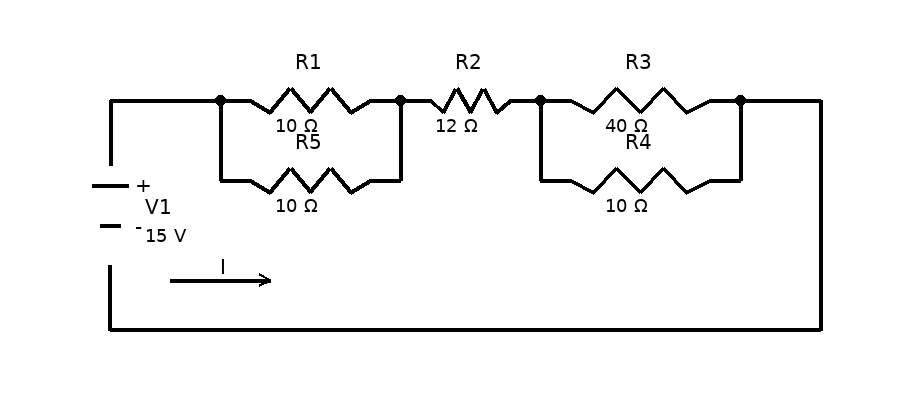

**Rezolvare**

Rezistențele paralele:

$$
R_{15} = R_1 \parallel R_5
= \frac{R_1 R_5}{R_1 + R_5}
= \frac{10 \cdot 10}{10 + 10}
= 5\,\Omega
$$

$$
R_{34} = R_3 \parallel R_4
= \frac{R_3 R_4}{R_3 + R_4}
= \frac{40 \cdot 10}{40 + 10}
= 8\,\Omega
$$

Rezistența totală:

$$
R_E = R_{15} + R_2 + R_{34}
= 5 + 12 + 8
= 25\,\Omega
$$

Curentul:

$$
I = \frac{U}{R_E}
= \frac{15}{25}
= 0{,}6\,A
$$

**Răspuns:** $R_E = 25\,\Omega$, $I = 0{,}6\,A$.

---

### Problema 3

Date:

$$
R_1 = 10\,\Omega,\quad
R_2 = 30\,\Omega,\quad
R_3 = 2{,}5\,\Omega,\quad
V_1 = 16\,V
$$

Să se determine:

$$
I_1,\ I_2,\ U_3,\ I,\ R_{12},\ R_E
$$

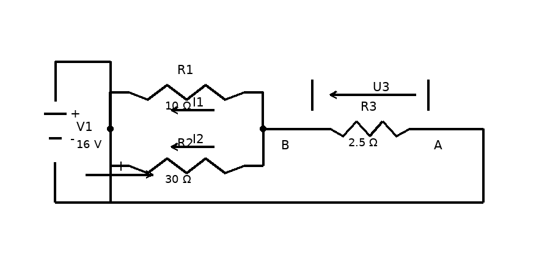

**Rezolvare**

Din sursă:

$$
V_1 = I \cdot R_3 + I_2 \cdot R_2
$$

$$
I_1 R_1 = I_2 R_2
$$

$$
I = I_1 + I_2
$$

Înlocuim numeric:

$$
16 = 2{,}5 I + 30 I_2
$$

$$
10 I_1 = 30 I_2 \Rightarrow I_1 = 3 I_2
$$

$$
I = I_1 + I_2
$$

Înlocuind $I = I_1 + I_2$ și $I_1 = 3I_2$:

$$
16 = 2{,}5 (I_1 + I_2) + 30 I_2
$$

$$
16 = 2{,}5 (3I_2 + I_2) + 30 I_2
$$

$$
16 = 2{,}5 \cdot 4 I_2 + 30 I_2 = 40 I_2
$$

$$
I_2 = \frac{16}{40} = 0{,}4\,A
$$

$$
I_1 = 3 I_2 = 1{,}2\,A
$$

$$
I = I_1 + I_2 = 1{,}2 + 0{,}4 = 1{,}6\,A
$$

Tensiunea pe $R_3$:

$$
U_3 = R_3 \cdot I = 2{,}5 \cdot 1{,}6 = 4\,V
$$

Rezistența echivalentă a lui $R_1$ și $R_2$ în paralel:

$$
R_{12} = R_1 \parallel R_2
= \frac{R_1 R_2}{R_1 + R_2}
= \frac{10 \cdot 30}{10 + 30}
= 7{,}5\,\Omega
$$

Rezistența totală:

$$
R_E = R_3 + R_{12} = 2{,}5 + 7{,}5 = 10\,\Omega
$$

**Răspuns:** $I_1 = 1{,}2\,A$, $I_2 = 0{,}4\,A$, $U_3 = 4\,V$, $I = 1{,}6\,A$, $R_{12} = 7{,}5\,\Omega$, $R_E = 10\,\Omega$.

---

### Problema 4

Date:

$$
R_1 = 12\,\Omega,\quad
R_2 = 36\,\Omega,\quad
V_1 = 18\,V
$$

Să se determine:

$$
U_1,\ U_2,\ I,\ R_E
$$

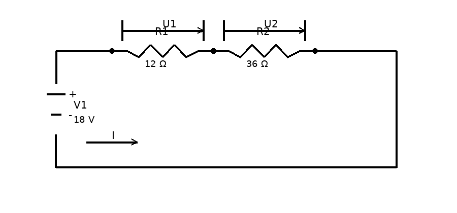

**Rezolvare**

Rezistențele sunt în serie, deci:

$$
V_1 = (R_1 + R_2) I
$$

$$
18 = (12 + 36) I
$$

$$
18 = 48 I
$$

$$
I = \frac{18}{48} = 0{,}375\,A
$$

Tensiunile pe rezistoare:

$$
U_1 = R_1 I = 12 \cdot 0{,}375 = 4{,}5\,V
$$

$$
U_2 = R_2 I = 36 \cdot 0{,}375 = 13{,}5\,V
$$

Rezistența echivalentă:

$$
R_E = R_1 + R_2 = 12 + 36 = 48\,\Omega
$$

**Răspuns:** $U_1 = 4{,}5\,V$, $U_2 = 13{,}5\,V$, $I = 0{,}375\,A$, $R_E = 48\,\Omega$.

---

### Problema 5

Date:

$$
R_1 = 7\,\Omega,\quad
R_2 = 5\,\Omega,\quad
R_3 = 3\,\Omega,\quad
R_4 = 6\,\Omega,\quad
R_5 = 8\,\Omega,\quad
R_6 = 9\,\Omega,\quad
V_1 = 12\,V
$$

Să se determine:

$$
U_1,\ I,\ R_E
$$

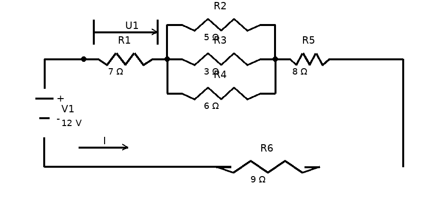

**Rezolvare**

Din schemă:

$$
R_E = R_1 + (R_2 \parallel R_3 \parallel R_4) + R_5 + R_6
$$

Pentru grupul paralel:

$$
\frac{1}{R_{234}} = \frac{1}{R_2} + \frac{1}{R_3} + \frac{1}{R_4}
$$

$$
\frac{1}{R_{234}} = \frac{1}{5} + \frac{1}{3} + \frac{1}{6}
= \frac{6 + 10 + 5}{30}
= \frac{21}{30}
= \frac{7}{10}
$$

$$
R_{234} = \frac{10}{7} \approx 1{,}428\,\Omega
$$

Rezistența totală:

$$
R_E = 7 + 1{,}428 + 8 + 9 = 25{,}428\,\Omega
$$

Curentul:

$$
I = \frac{U}{R_E}
= \frac{12}{25{,}428}
\approx 0{,}472\,A
$$

Tensiunea $U_1$:

$$
U_1 = R_1 \cdot I = 7 \cdot 0{,}472 \approx 3{,}3\,V
$$

**Răspuns:** $R_E \approx 25{,}428\,\Omega$, $I \approx 0{,}472\,A$, $U_1 \approx 3{,}3\,V$.

---

## 3. Diode semiconductoare

### Problema 4

Pentru schema de mai jos se consideră:

$$
E = 5\,V,\quad R = 220\,\Omega
$$

Să se determine:
1. regiunea de funcționare a diodei;
2. curentul continuu prin diodă;
3. rezistența de curent continuu a diodei;
4. rezistența de semnal mic a diodei la $T = 25^\circ C$.

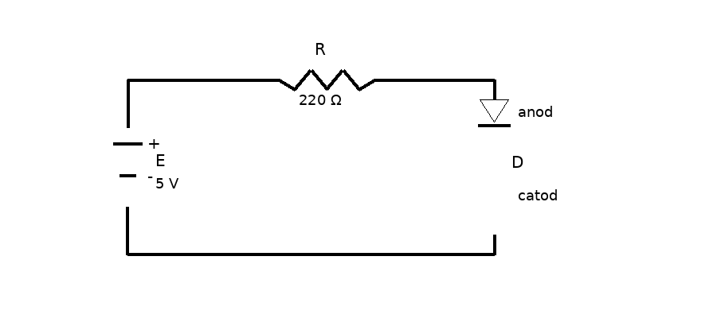

**Rezolvare**

Borna pozitivă a sursei este aplicată pe anod prin rezistor, iar borna negativă pe catod, deci dioda funcționează în **conducție directă**.

Pentru calculul curentului continuu, conform sursei, dioda este modelată cu:

$$
V_D = 0{,}6\,V
$$

Aplicând KVL pe buclă:

$$
R \cdot I_D + V_D - E = 0
$$

$$
I_D = \frac{E - V_D}{R}
$$

$$
I_D = \frac{5 - 0{,}6}{220}
= \frac{4{,}4}{220}
= 0{,}02\,A
= 20\,mA
$$

Rezistența de curent continuu:

$$
R_D = \frac{V_D}{I_D}
= \frac{0{,}6}{20\,mA}
= 30\,\Omega
$$

Rezistența de semnal mic:

$$
r_d = \frac{V_T}{I_D}
$$

La $25^\circ C$, din sursă:

$$
V_T = 25\,mV
$$

deci:

$$
r_d = \frac{25\,mV}{20\,mA} = 1{,}25\,\Omega
$$

**Răspuns:** conducție directă, $I_D = 20\,mA$, $R_D = 30\,\Omega$, $r_d = 1{,}25\,\Omega$.

---

### Problema 5

Pentru schema de mai jos se consideră:

$$
E_1 = 10\,V,\quad
R_1 = 4{,}7\,k\Omega,\quad
E_2 = 5\,V,\quad
R_2 = 2{,}2\,k\Omega
$$

Să se calculeze curentul continuu prin diodă și tensiunea $V$.

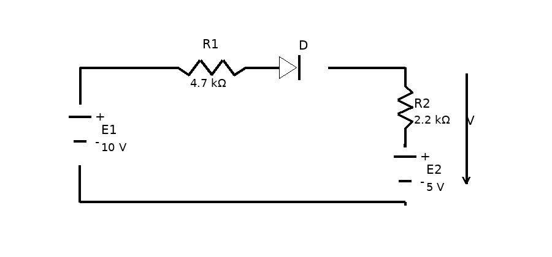

**Rezolvare**

Se presupune conducție directă și se folosește modelul cu:

$$
V_D = 0{,}6\,V
$$

Aplicând KVL pe circuitul echivalent, conform calculelor din sursă:

$$
R_1 I_D + V_D + R_2 I_D - E_2 - E_1 = 0
$$

$$
I_D = \frac{E_1 + E_2 - V_D}{R_1 + R_2}
$$

$$
I_D = \frac{10 + 5 - 0{,}6}{4{,}7\,k\Omega + 2{,}2\,k\Omega}
= \frac{14{,}4}{6{,}9\,k\Omega}
\approx 2{,}08\,mA
$$

Din rezolvarea din sursă, tensiunea $V$ este:

$$
V = R_2 I_D - E_2
$$

$$
V = 2{,}2\,k\Omega \cdot 2{,}08\,mA - 5\,V
\approx 4{,}57\,V - 5\,V
= -0{,}43\,V
$$

**Răspuns:** $I_D \approx 2{,}08\,mA$, $V \approx -0{,}43\,V$.

---

### Problema 6

Pentru schema de mai jos se consideră:

$$
E_1 = 15\,V,\quad
R = 2{,}2\,k\Omega,\quad
E_2 = 4\,V
$$

Să se calculeze curentul continuu prin cele două diode.

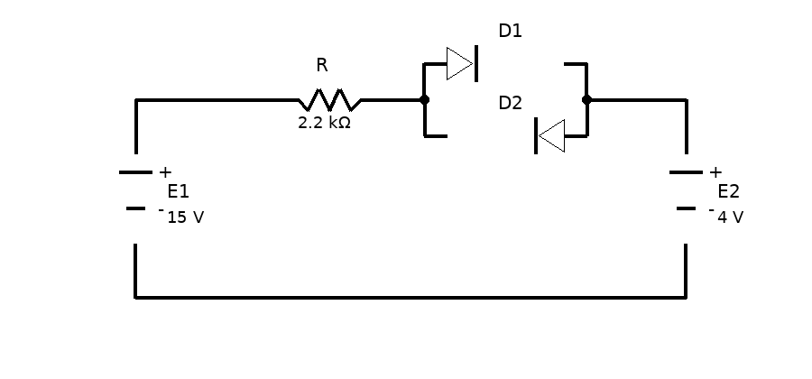

**Rezolvare**

Din orientarea surselor și a diodelor, în sursă se arată că:

- $D_1$ funcționează în **conducție directă**;
- $D_2$ funcționează în **conducție inversă**.

Prin urmare:

$$
I_{D2} = 0
$$

Pentru $D_1$, cu modelul:

$$
V_D = 0{,}6\,V
$$

Aplicând KVL:

$$
R I_{D1} + V_D - E_2 - E_1 = 0
$$

Conform calculelor din sursă:

$$
I_{D1} = \frac{E_1 + E_2 - V_D}{R}
$$

$$
I_{D1} = \frac{15 + 4 - 0{,}6}{2{,}2\,k\Omega}
= \frac{18{,}4}{2{,}2\,k\Omega}
\approx 8{,}36\,mA
$$

**Răspuns:** $I_{D1} \approx 8{,}36\,mA$, $I_{D2} = 0$.

---

### Problema 7

Pentru schema de mai jos se consideră:

$$
E = 20\,V,\quad
R_1 = 4{,}7\,k\Omega,\quad
R_2 = 3{,}5\,k\Omega
$$

iar parametrii diodelor sunt:

$$
V_{D1} = 0{,}65\,V,\quad
V_{D2} = 0{,}7\,V
$$

Să se calculeze curentul continuu prin cele două diode.

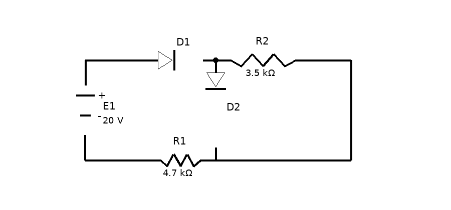

**Rezolvare**

Din rezolvarea din sursă, curentul prin ramura cu $R_2$ și $D_2$ este:

$$
R_2 I - V_{D2} = 0
$$

$$
I = \frac{V_{D2}}{R_2}
= \frac{0{,}7}{3{,}5\,k\Omega}
= 0{,}2\,mA
$$

Pentru bucla cu $V_{D1}$, $V_{D2}$, $R_1$ și sursa $E$:

$$
V_{D1} + V_{D2} + R_1 I_{D1} - E = 0
$$

$$
I_{D1} = \frac{E - (V_{D1} + V_{D2})}{R_1}
$$

$$
I_{D1}
= \frac{20 - (0{,}65 + 0{,}7)}{4{,}7\,k\Omega}
= \frac{18{,}65}{4{,}7\,k\Omega}
\approx 3{,}96\,mA
$$

Din KCL în nodul superior:

$$
I_{D1} = I_{D2} + I
$$

$$
I_{D2} = I_{D1} - I = 3{,}96\,mA - 0{,}2\,mA = 3{,}76\,mA
$$

**Răspuns:** $I = 0{,}2\,mA$, $I_{D1} \approx 3{,}96\,mA$, $I_{D2} \approx 3{,}76\,mA$.
